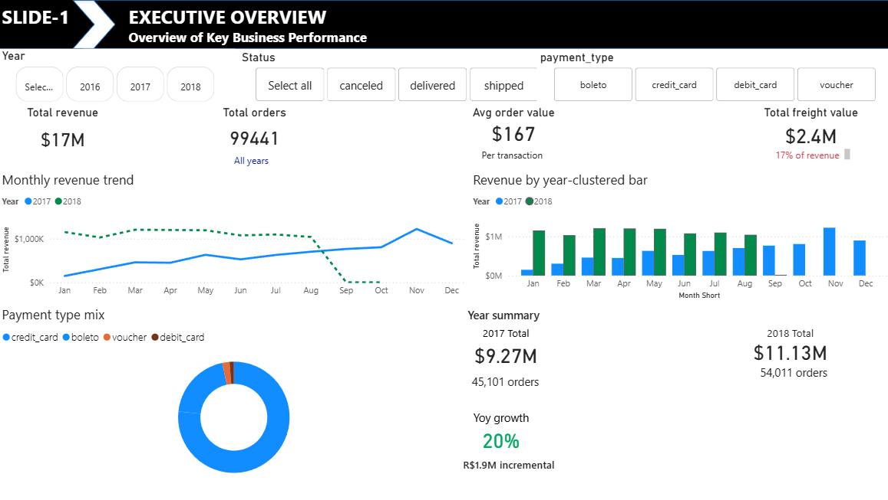
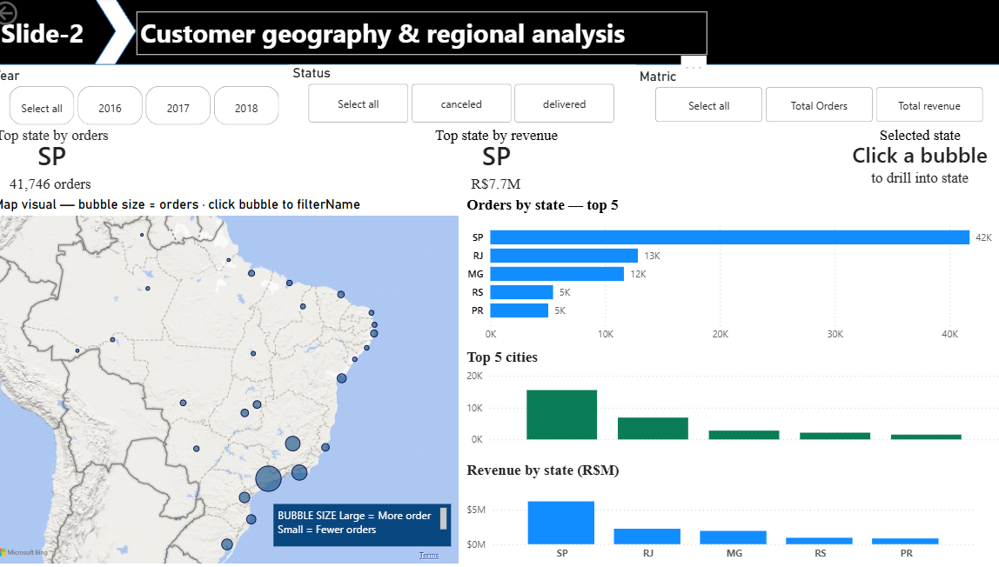
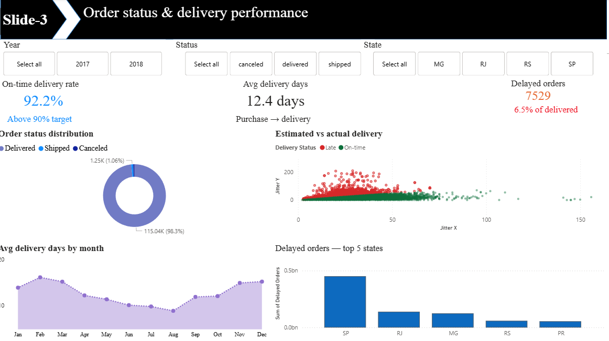
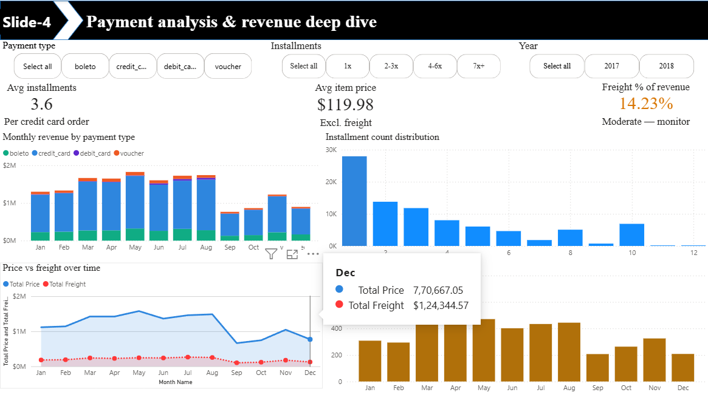
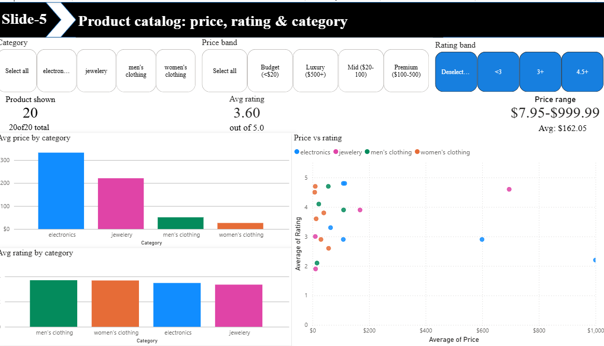
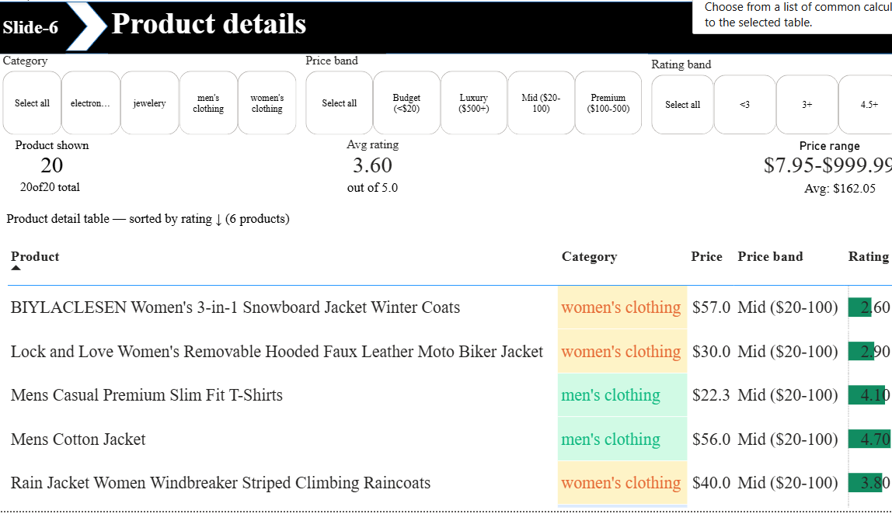
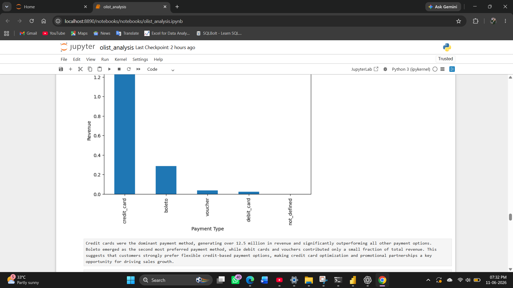
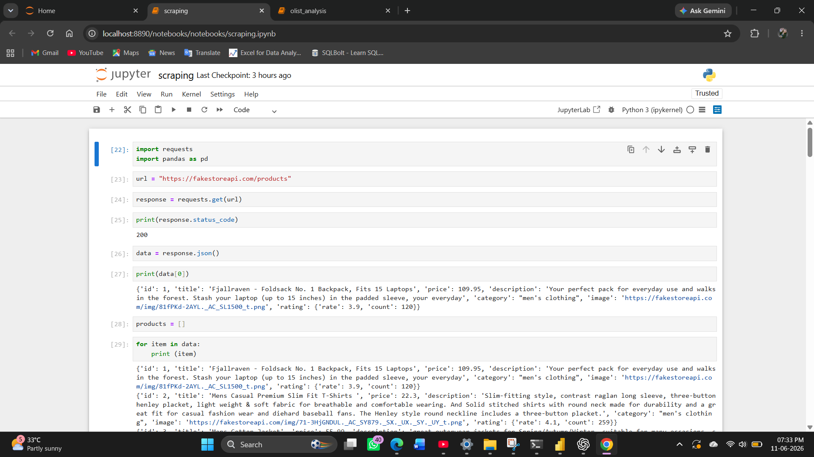

# 🛒 E-Commerce Analytics Dashboard

## 📌 Overview
This project analyzes e-commerce sales performance, customer behavior, payment trends, delivery performance, and product insights using Python, Power BI, and web-scraped product data.
The goal was to transform raw business data into actionable insights through data cleaning, KPI calculation, exploratory analysis, and dashboard development.

## 🛠️ Tools Used
- Python
- Pandas
- NumPy
- Power BI
- DAX
- Web Scraping
- SQL (Work in Progress)

## 📂 Project Structure

ecommerce_project
├── Dashboard
│ └── Ecommerce Dashboard.pbix
├── Data
│ ├── Raw
│ │ ├── olist_customers_dataset.csv
│ │ ├── olist_orders_dataset.csv
│ │ ├── olist_order_items_dataset.csv
│ │ ├── olist_order_payments_dataset.csv
│ │ └── other Olist source files
│ │
│ └── Clean
│ ├── dashboard_dataset.csv
│ └── ecommerce_products.csv
├── Notebooks
│ ├── Olist Analysis.ipynb
│ └── Ecommerce Product Scraping.ipynb
├── SQL
│ └── (To Be Added)
└── README.md

## 📊 Dashboard Overview
The Power BI dashboard consists of 6 analytical pages designed to provide a complete view of business performance.

## 📈 Dashboard Pages

### 1️⃣ Executive Overview
Provides a high-level business performance summary.

**Key Metrics**
- Revenue: $17M
- Orders: 99,441
- YoY Growth: 20%
- Credit Card Usage: 95%
- Freight Cost: 17% of Revenue

### 2️⃣ Customer Geography
Analyzes regional customer distribution and sales concentration.

**Key Insights**
- São Paulo (SP): 41,746 Orders
- SP, RJ, and MG are the top-performing states
- Sales are concentrated in South-East Brazil

### 3️⃣ Order & Delivery Analysis
Evaluates delivery performance and operational efficiency.

**Key Insights**
- 92.2% On-Time Delivery
- 12.4 Days Average Delivery Time
- 98.3% Orders Successfully Delivered
- SP experiences the highest delivery delays

### 4️⃣ Payment Analysis
Analyzes customer payment behavior and transaction trends.

**Key Insights**
- Average Installments: 3.6
- Average Order Value: $120
- Freight Cost: 14.23%
- May–August represents the highest-value transaction period

### 5️⃣ Product Catalog Analysis
Analyzes pricing, ratings, and category-level performance using scraped product data.

**Key Insights**
- Product Price Range: $8–$1000
- Electronics are the highest-priced category
- Men's and Women's Clothing categories have the highest ratings
- Overall Product Rating: 3.6/5

### 6️⃣ Product Details Analysis
Provides detailed product-level insights.

**Key Insights**
- Best Rated Product: Men's Cotton Jacket (4.70)
- Lowest Rated Product: Women's Snowboard Jacket (2.60)
- Majority of products fall within the $20–$100 price range

## 🐍 Python Analysis
Python was used for:
- Data Cleaning
- Data Transformation
- KPI Calculation
- Exploratory Data Analysis
- Dataset Preparation for Power BI

**KPIs Calculated**
- Total Revenue
- Total Orders
- Total Customers
- Average Order Value
- Payment Distribution
- Delivery Metrics

## 🌐 Web Scraping
A custom web scraping notebook was developed to collect product-level market data.

**Scraped Fields**
- Product Title
- Price
- Category
- Rating

The scraped dataset was used to create product pricing and market insights dashboards.

## 📁 Datasets Used

**Olist E-Commerce Dataset**
Used for:
- Orders Analysis
- Customer Analysis
- Payment Analysis
- Delivery Analysis

**Scraped Product Dataset**
Used for:
- Product Pricing Analysis
- Category Analysis
- Product Rating Analysis
- Market Insights

## 🔍 Key Business Insights
- Revenue growth remained strong across the analysis period
- Credit cards dominate customer payment preferences
- South-East Brazil generates the majority of business revenue
- Delivery performance exceeds operational targets
- Product ratings vary significantly across categories
- Electronics command premium pricing compared to other categories

## 🚀 Future Improvements
- SQL-Based Business Analysis
- Advanced DAX Measures
- Predictive Analytics & Forecasting
- Customer Segmentation
- Automated Data Pipeline

## 👩‍💻 Author
**Mamta Yadav**  
Aspiring Data Analyst  
Python • SQL • Power BI • Data Visualization • Web Scraping • Business Intelligenc*